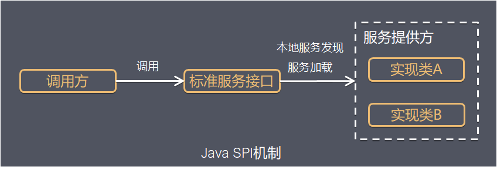

## SPI 是什么
SPI 全程 Service Provider Interface，是 Java 提供的一套用来被第三方实现或者扩展的 API，它可以用来启用框架扩展和替换组件。



Java SPI 实际上是“ **基于接口的编程+配置文件** ”组合实现的动态加载机制。

系统设计的各个抽象，往往有很多不同的实现方案，在面向的对象的设计里，一般推荐模块之间基于接口编程，模块之间不对实现类进行硬编码。一旦代码里涉及具体的实现类，就违反了可插拔的原则，如果需要替换一种实现，就需要修改代码。为了实现在模块装配的时候能不在程序里动态指明，这就需要一种服务发现机制。
Java SPI 就是提供这样的一个机制：为某个接口寻找服务实现的机制。有点类似 IOC 的思想，就是将装配的控制权移到程序之外，在模块化设计中这个机制尤其重要。所以 SPI 的核心思想就是 **解耦** 。

## 使用场景
概括地说，适用于： **调用者根据实际使用需要，启用、扩展、或者替换框架的实现策略**

比较常见的例子：
- 数据库驱动加载接口实现类的加载
  - JDBC 加载不同类型数据库的驱动
- 日志门面接口实现类加载
  - SLF4J 加载不同提供商的日志实现类
- Spring
  - Spring 中大量使用了 SPI，比如：对 Servlet3.0 规范对 ServletContainerInitializer 的实现、自动类型转换 Type Conversion SPI(Converter SPI、Formatter SPI) 等。
- Dubbo
  - Dubbo 中也大量使用 SPI 的方式实现框架的扩展，不过它对 Java 提供的原生 SPI 做了封装，允许用户扩展实现 Filter 接口。

## 使用介绍
要使用 Java SPI，需要遵循如下约定：
1. 当服务提供者提供了接口的一种具体实现后，在 jar 包的 `META-INF/services` 目录下创建一个以“接口全限定名”为命名的文件，内容为实现类的全限定名；
2. 接口实现类所在的 jar 包放在主程序的 classpath 中；
3. 主程序通过 `java.util.ServiceLoader` 动态装在实现模块，它通过扫描 `META-INF/service` 目录下的配置文件找到实现类的全限定名，把类加载到 JVM；
4. SPI 的实现类必须携带一个不带参数的构造方法；

### 示例代码
**步骤1：** 定义一组接口（假设是 `org.foo.demo.IShout` ），并写出接口的一个或多个实现，（假设是 `org.foo.demo.animal.Dog、org.foo.demo.animal.Cat` ）。
```java
public interface IShout {
    void shout();
}
public class Cat implements IShout {
    @Override
    public void shout() {
        System.out.println("miao miao");
    }
}
public class Dog implements IShout {
    @Override
    public void shout() {
        System.out.println("wang wang");
    }
}
```

**步骤2：** 在 `src/main/resources/` 下建立 `/META-INF/services` 目录， 新增一个以接口命名的文件 (`org.foo.demo.IShout` 文件)，内容是要应用的实现类（这里是 `org.foo.demo.animal.Dog` 和 `org.foo.demo.animal.Cat` ，每行一个类）。
文件位置
```
- src
    -main
        -resources
            - META-INF
                - services
                    - org.foo.demo.IShout
```

文件内容：
```
org.foo.demo.animal.Dog
org.foo.demo.animal.Cat
```

**步骤3：** 使用 `ServiceLoader` 来加载配置文件中指定的实现。
```java
public class SPIMain {
    public static void main(String[] args) {
        ServiceLoader<IShout> shouts = ServiceLoader.load(IShout.class);
        for (IShout s : shouts) {
            s.shout();
        }
    }
}
```

## 原理解析
首先看 `ServiceLoader` 类的签名类的成员变量：
```java
public final class ServiceLoader<S> implements Iterable<S>{
private static final String PREFIX = "META-INF/services/";

    // 代表被加载的类或者接口
    private final Class<S> service;

    // 用于定位，加载和实例化providers的类加载器
    private final ClassLoader loader;

    // 创建ServiceLoader时采用的访问控制上下文
    private final AccessControlContext acc;

    // 缓存providers，按实例化的顺序排列
    private LinkedHashMap<String,S> providers = new LinkedHashMap<>();

    // 懒查找迭代器
    private LazyIterator lookupIterator;
  
    ......
}
```

参考具体 `ServiceLoader` 具体源码，代码量不多，加上注释一共 587 行，梳理了一下，实现的流程如下：
1. 应用程序调用 ServiceLoader.load 方法，ServiceLoader.load 方法内创建一个新的 ServiceLoader，并实例化该类中的成员变量，包括：
   1. loader(ClassLoader类型，类加载器)
   2. acc(AccessControlContext 类型，访问控制器)
   3. providers(LinkedHashMap<String, S> 类型，用于缓存加载成功的类)
   4. loopupIterator(实现迭代器功能)
2. 应用程序通过迭代器接口获取对象实例
   - ServiceLoader 先判断成员变量 providers 对象中 (LinkedHashMap<String, S> 类型) 是否有缓存实例对象，如果有缓存，直接返回。如果没有缓存，执行类的装在，实现如下：
     - 读取 `META/services/` 下的配置文件，获得所有能被实例化的类的名称，值得注意的是，ServiceLoader **可以跨越 jar 包获取 META-INF 的配置文件** ，具体加载配置的实现代码如下：
     - ```java
        try {
            String fullName = PREFIX + service.getName();
            if (loader == null)
                configs = ClassLoader.getSystemResources(fullName);
            else
                configs = loader.getResources(fullName);
        } catch (IOException x) {
            fail(service, "Error locating configuration files", x);
        }
       ```
     - 通过反射方法 Class.forName() 加载类对象，并用 instance() 方法将类实例化
     - 把实例化后的类缓存到 providers 对象中，(LinkedHashMap<String, S> 类型) 然后返回实例对象。

## 总结
**优点：**
使用 Java SPI 机制的优势是实现解耦，使得第三方服务模块的装配控制的逻辑与调用者的业务代码分离，而不是耦合在一起。应用程序可以根据业务情况启用框架扩展或替换框架组件。

相比使用提供接口 jar 包，供第三方服务模块实现接口的方式，SPI 的方式使得源框架，不必关心接口的实现类的路径，可以不用通过下面的方式获取接口实现类：
- 代码硬编码 import 导入实现类
- 指定类全路径反射获取：例如在 JDBC4.0 之前，JDBC 中获取数据库驱动类需要通过 **Class.forName("com.mysql.jdbc.Driver")** ，类似语句先动态加载数据库相关的驱动，然后再进行获取连接等的操作。
- 第三方服务模块吧接口实现类实例注册到指定地方，源框架从该处访问实例

通过 SPI 的方式，第三方服务模块实现接口后，在第三方的项目代码的 `META-INF/services` 目录下的配置文件指定实现类的全路径名，源码框架即可找到实现类。

**缺点：**
- 虽然 ServiceLoader 也算是使用的延迟加载，但是基本只能通过遍历全部获取，也就是接口的实现类全部加载并实例化一遍。如果你并不想用某些实现类，它也被加载并实例化了，这就造成了浪费。获取某个实现类的方式不够灵活，只能通过 Iterator 形式获取，不能根据某个参数来获取对应的实现类。
- 多个并发多线程使用 ServiceLoader 类的实例是不安全的。