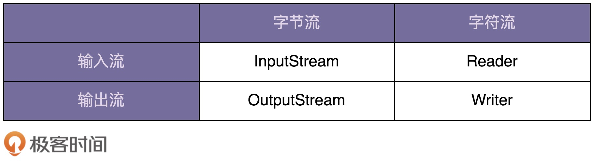
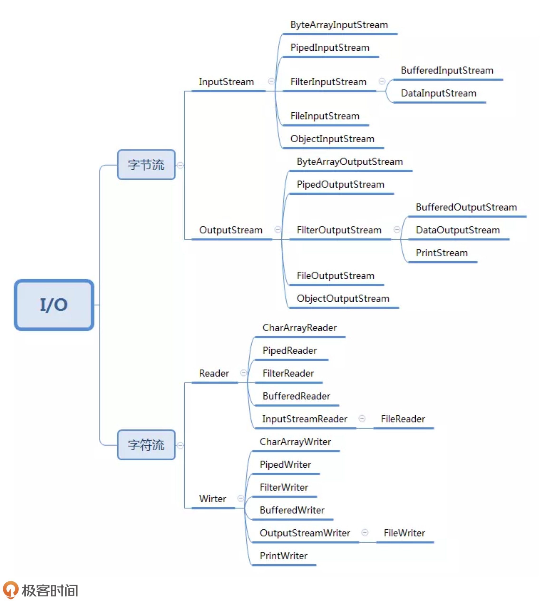

> 通过剖析 Java IO 类库源码学习装饰器模式

### Java IO 类的“奇怪”用法
- Java IO 类库非常庞大和复杂，有几十个类，负责 IO 数据的读和写。对 Java IO 类做一下分类如下图示：

- Java IO 子类拓扑图：


#### 基于继承的设计方案
- 如果 InputStream 只有一个子类 FileInputStream 的话，那我们在 FileInputStream 基础之上，再设计一个孙子类 BufferedFileInputStream，也算是可以接受的，毕竟继承结构还算简单。
- 如果我们还需要既支持缓存、又支持按照基本类型读取数据的类，那就要再继续派生出 BufferedDataFileInputStream、BufferedDataPipedInputStream 等 n 多类。
- 如果需要附加更多的增强功能，那就会导致组合爆炸，类继承结构变得无比复杂，代码既不好扩展，也不好维护。

#### 基于装饰模式的设计方案
- 针对刚刚的继承结构过于复杂的问题，我们可以通过将继承关系改为组合关系来解决。
- 装饰器模式相对于简单的组合关系，有两个比较特殊的地方：
  - **第一个比较特殊的地方是：装饰器类和原始类继承同样的父类，这样我们可以对原始类“嵌套”多个装饰器类。**
  - **第二个比较特殊的地方是：装饰器类是对功能的增强，这也是装饰器模式应用场景的一个重要特点。**
    - 代理模式和装饰器模式的区别：
      - 在代理模式中，代理附加的是跟原始类无关的功能；
      - 而在装饰器模式中，装饰器类附加的是跟原始类相关的增强功能。

```java

// 代理模式的代码结构(下面的接口也可以替换成抽象类)
public interface IA {
  void f();
}
public class A impelements IA {
  public void f() { //... }
}
public class AProxy impements IA {
  private IA a;
  public AProxy(IA a) {
    this.a = a;
  }
  
  public void f() {
    // 新添加的代理逻辑
    a.f();
    // 新添加的代理逻辑
  }
}

// 装饰器模式的代码结构(下面的接口也可以替换成抽象类)
public interface IA {
  void f();
}
public class A impelements IA {
  public void f() { //... }
}
public class ADecorator impements IA {
  private IA a;
  public ADecorator(IA a) {
    this.a = a;
  }
  
  public void f() {
    // 功能增强代码
    a.f();
    // 功能增强代码
  }
}
```

- 为了避免代码重复，Java IO 抽象出了一个装饰器父类 FilterInputStream，代码实现如下所示。
- InputStream 的所有的装饰器类（BufferedInputStream、DataInputStream）都继承自这个装饰器父类。
- 这样，装饰器类只需要实现它需要增强的方法就可以了，其他方法继承装饰器父类的默认实现。

### 小结
- 装饰器模式主要解决继承关系过于复杂的问题，通过组合来替代继承。它主要的作用是给原始类添加增强功能。这也是判断是否该用装饰器模式的一个重要的依据。除此之外，装饰器模式还有一个特点，那就是可以对原始类嵌套使用多个装饰器。为了满足这个应用场景，在设计的时候，装饰器类需要跟原始类继承相同的抽象类或者接口。