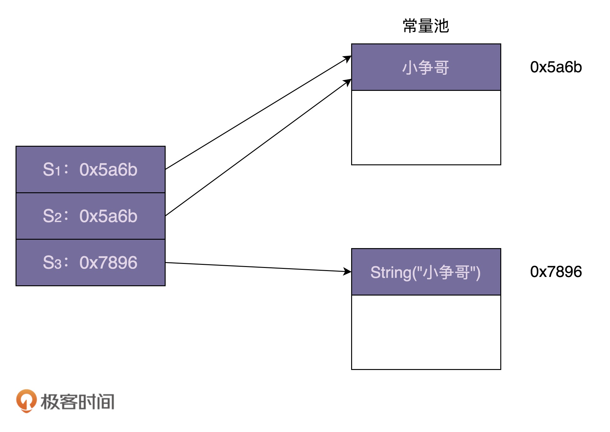

> 如何利用享元模式优化文本编辑器的内存占用

## 享元模式原理与实现
### 定义：
- 所谓“享元”，顾名思义就是被共享的单元。享元模式的意图是复用对象，节省内存，前提是享元对象是不可变对象。
- 当一个系统中存在大量重复对象的时候，我们就可以利用享元模式，将对象设计成享元，在内存中只保留一份实例，供多处代码引用，这样可以减少内存中对象的数量，以起到节省内存的目的。
- 不仅仅相同对象可以设计成享元，对于相似对象，我们也可以将这些对象中相同的部分（字段），提取出来设计成享元，让这些大量相似对象引用这些享元。
- 定义中的“不可变对象”指的是，一旦通过构造函数初始化完成之后，它的状态（对象的成员变量或者属性）就不会再被修改了。**所以，不可变对象不能暴露任何 set() 等修改内部状态的方法。**

## 享元模式 vs 单例、缓存、对象池
### 享元模式跟单例的区别。
在单例模式中，一个类只能创建一个对象，而在享元模式中，一个类可以创建多个对象，每个对象被多处代码引用共享。实际上，享元模式有点类似于之前讲到的单例的变体：多例。

我们前面也多次提到，区别两种设计模式，不能光看代码实现，而是要看设计意图，也就是要解决的问题。尽管从代码实现上来看，享元模式和多例有很多相似之处，但从设计意图上来看，它们是完全不同的。**应用享元模式是为了对象复用，节省内存，而应用多例模式是为了限制对象的个数。**

### 享元模式跟缓存的区别。
在享元模式的实现中，我们通过工厂类来“缓存”已经创建好的对象。这里的“缓存”实际上是“存储”的意思，跟我们平时所说的“数据库缓存”“CPU 缓存”“MemCache 缓存”是两回事。**我们平时所讲的缓存，主要是为了提高访问效率，而非复用**

### 享元模式跟对象池的区别。
- 什么是对象池：
  - 像 C++ 这样的编程语言，内存的管理是由程序员负责的。为了避免频繁地进行对象创建和释放导致内存碎片，我们可以预先申请一片连续的内存空间，也就是这里说的对象池。每次创建对象时，我们从对象池中直接取出一个空闲对象来使用，对象使用完成之后，再放回到对象池中以供后续复用，而非直接释放掉。

- 池化技术中的“复用”可以理解为“重复使用”，主要目的是节省时间（比如从数据库池中取一个连接，不需要重新创建）。在任意时刻，每一个对象、连接、线程，并不会被多处使用，而是被一个使用者独占，当使用完成之后，放回到池中，再由其他使用者重复利用。**享元模式中的“复用”可以理解为“共享使用”，在整个生命周期中，都是被所有使用者共享的，主要目的是节省空间。**

## 享元模式在 String 中的应用
```java
String s1 = "小争哥";
String s2 = "小争哥";
String s3 = new String("小争哥");

System.out.println(s1 == s2);
System.out.println(s1 == s3);
```



- String 类的享元模式的设计，跟 Integer 类稍微有些不同。Integer 类中要共享的对象，是在类加载的时候，就集中一次性创建好的。但是，对于字符串来说，我们没法事先知道要共享哪些字符串常量，所以没办法事先创建好，只能在某个字符串常量第一次被用到的时候，存储到常量池中，当之后再用到的时候，直接引用常量池中已经存在的即可，就不需要再重新创建了。

### 享元模式缺点或不足：
- 享元模式对 JVM 的垃圾回收并不友好。因为享元工厂类一直保存了对享元对象的引用，这就导致享元对象在没有任何代码使用的情况下，也并不会被 JVM 垃圾回收机制自动回收掉。因此，在某些情况下，如果对象的生命周期很短，也不会被密集使用，利用享元模式反倒可能会浪费更多的内存。所以，除非经过线上验证，利用享元模式真的可以大大节省内存，否则，就不要过度使用这个模式，为了一点点内存的节省而引入一个复杂的设计模式，得不偿失。