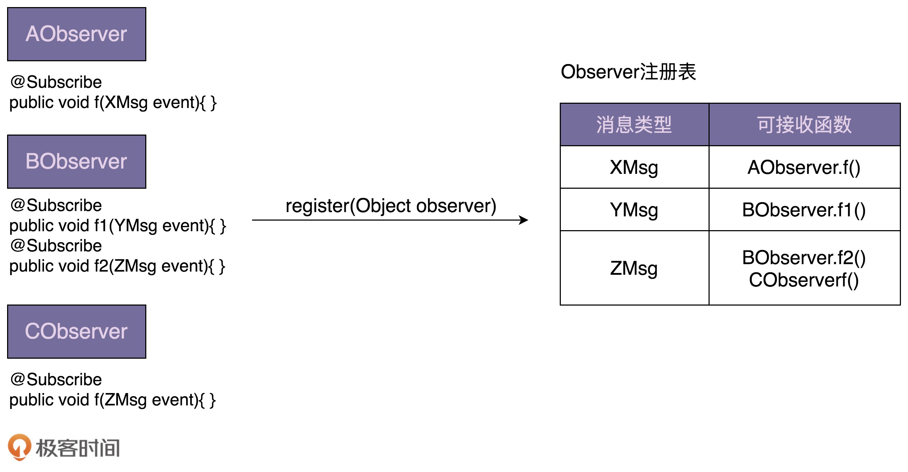
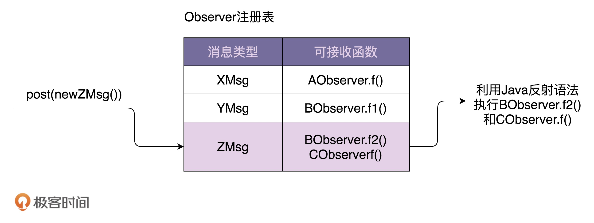

> 详解各种应用场景下观察者模式的不同实现方式

## 原理及应用场景
- 根据应用场景的不同，观察者模式会对应不同的代码实现方式：有同步阻塞的实现方式，也有异步非阻塞的实现方式；有进程内的实现方式，也有跨进程的实现方式。

### 定义
> Define a one-to-many dependency between objects so that when one object changes state, all its dependents are notified and updated automatically.

在对象之间定义一个一对多的依赖，当一个对象状态改变的时候，所有依赖的对象都会自动收到通知。

一般情况下，被依赖的对象叫作被观察者（Observable），依赖的对象叫作观察者（Observer）。

### 最经典、最常见的一种观察者模式的实现方式
- （代码详见于目录 simpleobserver 中）

- 实际上，上面的代码算是观察者模式的“模板代码”，只能反映大体的设计思路。在实际的软件开发中，并不需要照搬上面的模板代码。设计思路都是差不多的。

### 应用场景
1. 假设我们在开发一个 P2P 投资理财系统，用户注册成功之后，我们会给用户发放投资体验金。代码大概如下：
```java
public class UserController {
  private UserService userService; // 依赖注入
  private PromotionService promotionService; // 依赖注入

  public Long register(String telephone, String password) {
    //省略输入参数的校验代码
    //省略userService.register()异常的try-catch代码
    long userId = userService.register(telephone, password);
    promotionService.issueNewUserExperienceCash(userId);
    return userId;
  }
}
```

- 虽然注册接口做了两件事情，注册和发放体验金，违反单一职责原则，但是，**如果没有扩展和修改的需求，现在的代码实现是可以接受的。** 如果非得用观察者模式，据需要引入更多的类和更加复杂的代码结构，反倒是一种过度设计。

- 但是，**如果在需求频繁变动的情况下。** 例如，业务方需求变更频繁，注册逻辑可能会频繁的变动。这种情况下，务必会频繁的变更注册方法的代码，违反开闭原则。也会使得代码逻辑越来越复杂，影响到代码的可读性和可维护性。**这个时候就很适合使用观察者模式，对代码进行重构。**

- 基于观察者模式的代码实现，UserController 类的 register() 方法完全不需要修改，只需要再添加一个实现了 RegObserver 接口的类，并且通过 setRegObserver() 函数将它注册到 UserController 类中即可。

### 小结：
实际上，设计模式要干的事情就是解耦。
- 创建型模式是将创建和使用代码解耦；
- 结构型模式是将不同功能代码解耦；
- 行为型模式是将不同的行为代码解耦；
</br>
具体到观察者模式，它是将观察者和被观察者代码解耦。

借助设计模式，我们利用更好的代码结构，将一大坨代码拆分成职责更单一的小类让其满足开闭原则、高内聚松耦合等特性，以此来控制和应对代码的复杂性，提高代码的可扩展性。

## 基于不同应用场景的不同实现方式
- 观察者模式的应用场景非常广泛，**小到代码层面的解耦，大到架构层面的系统解耦，再或者一些产品的设计思路**，都有这种模式的影子，比如：邮件订阅、RSS Feeds，本质上都是观察者模式。
- 不同的应用场景和需求下，这个模式也有截然不同的实现方式，**有同步阻塞的实现方式，也有异步非阻塞的实现方式；有进程内的实现方式，也有跨进程的实现方式。**

### 如何实现一个异步非阻塞的观察者模式：
1. 在每个 handle 函数中，创建一个新的线程执行代码。
2. 第二种实现方式是：借鉴 Google Guava EventBus 框架的设计思想，实现异步非阻塞的 EventBus 来实现。（实现一个支持异步非阻塞的 EventBus 框架。它可以复用在任何需要异步非阻塞观察者模式的应用场景中。）

### 在跨进程的观察者模式实现：
- 如果大数据征信系统提供了发送用户注册信息的 RPC 接口，我们仍然可以沿用之前的实现思路，在 handler 函数中调用 RPC 接口来发送数据。
- 另一种更优雅、更常用的实现方式：基于消息队列（如：ActiveMQ）来实现。

- **利与弊**
  - 弊端：
    - 需要引入一个新的系统（消息队列），增加了维护成本。
  - 好处：
    - 在原来的实现方式中，观察者需要注册到被观察者中，被观察者需要依次遍历观察者来发送消息。
    - 而基于消息队列的实现方式，被观察者和观察者解耦更加彻底，两部分的耦合更小。
    - 被观察者完全不感知观察者，观察者也完全不感知被观察者。被观察者只管发送消息到消息队列，观察者只管从消息队列中读取消息来执行相应的逻辑。


## 实现一个异步非阻塞的 EventBus 框架
> 同步阻塞是最经典的实现方式，主要是为了代码解耦；异步非阻塞除了能实现代码解耦之外，还能提高代码的执行效率；
> 进程间的观察者模式解耦更加彻底，一般是基于消息队列来实现，用来实现不同进程间的被观察者和观察者之间的交互。

### 异步非阻塞观察者模式的简易实现
- 框架的作用：隐藏实现细节，降低开发难度，做到代码复用，解耦业务与非业务代码，让程序员聚焦业务开发。

#### EventBus 框架功能需求介绍
- EventBus 翻译为“事件总线”，它提供了实现观察者模式的骨架代码。我们可以基于此框架，非常容易地在自己的业务场景中实现观察者模式，不需要从零开始开发。
- Google Guava EventBus 是比较著名的 EventBus 框架，它不仅仅支持异步非阻塞模式，同时支持同步阻塞模式。

- 利用 EventBus 框架实现的观察者模式，跟从零开始编写的观察者模式相比，从大的流程上来说，实现思路大致一样，都需要定义 Observer，并且通过 register() 函数注册 Observer，也都需要通过调用某个函数来给 Observer 发送消息（在 EventBus 中消息被称作事件 event）。

- 在实现细节方面，基于 EventBus，我们不需要定义 Observer 接口，任意类型的对下个哦都可以注册到 EventBus 中，通过@Subscribe 注解来标明类中哪个函数可以接收被观察者发送的消息。

#### Guava EventBus 的几个主要的类和函数
- EventBus、AsyncEventBus
  - Guava EventBus 对外暴露的所有可调用接口，都封装在 EventBus 类中。其中，EventBus 实现了同步阻塞的观察者模式，AsyncEventBus 继承自 EventBus，提供了异步非阻塞的观察者模式。
- register() 函数
  - EventBus 类提供了 register() 函数用来注册观察者。具体的函数定义如下所示。它可以接受任何类型（Object）的观察者。而在经典的观察者模式的实现中，register() 函数必须接受实现了同一 Observer 接口的类对象。
- unregister() 函数
  - 相对于 register() 函数，unregister() 函数用来从 EventBus 中删除某个观察者。
- post() 函数
  - EventBus 类提供了 post() 函数，用来给观察者发送消息。
  - 与经典的观察者模式的区别：
    - 当调用 post() 函数发送消息的时候，并非把消息发送给所有的观察者，而是发送给可匹配的观察者。所谓可匹配指的是，能接收的消息类型是发送消息（post 函数定义中的 event）类型的父类。
- @Subscribe 注解
  - EventBus 通过 @Subscribe 注解来标明，某个函数能接收哪种类型的消息。
  - 当通过 register() 函数将 DObserver 类对象注册到 EventBus 的时候，EventBus 会根据 @Subscribe 注解找到 f1() 和 f2()，并且将两个函数能接收的消息类型记录下来（PMsg->f1，QMsg->f2）。当我们通过 post() 函数发送消息（比如 QMsg 消息）的时候，EventBus 会通过之前的记录（QMsg->f2），调用相应的函数（f2）。


## 实现一个 EventBus 框架
- EventBus 中两个核心函数 register() 和 post() 的实现原理。如下图所示：



- **原理：**
  - 最关键的一个数据结构是 Observer 注册表，记录了消息类型和可接收消息函数的对应关系。当调用 register() 函数注册观察者的时候，EventBus 通过解析 @Subscribe 注解，生成 Observer 注册表。当调用 post() 函数发送消息的时候，EventBus 通过注册表找到相应的可接收消息的函数，然后通过 Java 的反射语法来动态地创建对象、执行函数。对于同步阻塞模式，EventBus 在一个线程内依次执行相应的函数。对于异步非阻塞模式，EventBus 通过一个线程池来执行相应的函数。

### 整个小框架的代码实现包括 5 个类：
- EventBus\AsyncEventBus\Subscribe\ObserverAction\ObserverRegistry。

#### 1. Subscribe
Subscribe 是一个注解，用于标明观察者中的哪个函数可以接收消息。

#### 2. ObserverAction
ObserverAction 类用来表示 @Subscribe 注解的方法，其中，target 表示观察者类，method 表示方法。它主要用在 ObserverRegistry 观察者注册表中。

#### 3. ObserverRegistry
ObserverRegistry 类就是前面讲到的 Observer 注册表，是最复杂的一个类，框架中几乎所有的核心逻辑都在这个类中。这个类大量使用了 Java 的反射语法，不过代码整体来说都不难理解，其中，一个比较有技巧的地方是 CopyOnWriteArraySet 的使用。

CopyOnWriteArraySet，顾名思义，在写入数据的时候，会创建一个新的 set，并且将原始数据 clone 到新的 set 中，在新的 set 中写入数据完成之后，再用新的 set 替换老的 set。这样就能保证在写入数据的时候，不影响数据的读取操作，以此来解决读写并发问题。

#### 4. EventBus
EventBus 实现的是阻塞同步的观察者模式。看代码你可能会有些疑问，这明明就用到了线程池 Executor 啊。实际上，MoreExecutors.directExecutor() 是 Google Guava 提供的工具类，看似是多线程，实际上是单线程。之所以要这么实现，主要还是为了跟 AsyncEventBus 统一代码逻辑，做到代码复用。

#### 5. AsyncEventBus
有了 EventBus，AsyncEventBus 的实现就非常简单了。为了实现异步非阻塞的观察者模式，它就不能再继续使用 MoreExecutors.directExecutor() 了，而是需要在构造函数中，由调用者注入线程池。