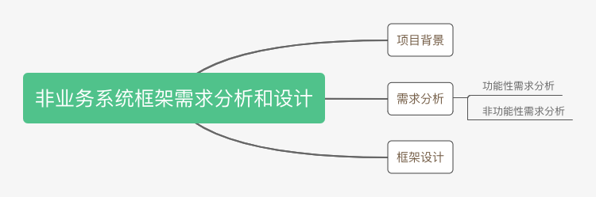

### 需求分析
1. 功能性需求分析
  - 根据需求背景去拆解，分析具体的需要实现的功能需求有哪些；
  - 罗列出来功能点，人脑更容易理解短的、罗列的比较规整的、分门别类的列表信息。
2. 借助工具，把数据用线框图的样式给画出来，以此触发，挖掘隐藏需求
   - 统计触发方式
   - 统计时间区间
   - 统计时间间隔

3. 非功能性需求分析
   1. 考虑的点：
      1. 易用性
      2. 性能
      3. 扩展性
      4. 容错性
      5. 通用性

### 框架设计
- 遵循测试驱动开发和最小原型
- 首先聚焦一个简单的应用场景，基于此设计实现一个简单的原型。
- 基于这个简单的原型做迭代。

### 面向对象设计与实现
1. 职责划分
2. 定义类与类之间的关系
   - 现在 IDE 中定义好这几个类，然后定义它们的属性和方法。
   - 在设计类、类与类之间交互的时候，不断地用之前学过的设计原则和思想来审视设计是否合理，比如，是否满足单一职责原则、开闭原则、依赖注入、KISS 原则、DRY 原则、迪米特法则；
   - 是否符合基于接口而非实现的编程思想，代码是否高内聚、低耦合，是否可以抽象出可复用代码等等；
   - **面向对象设计和实现要做的事情，就是把合适的代码放到合适的类中。**
3. 将类组装起来并提供执行入口
4. Review 设计和实现呢

- **写代码的过程本就是一个修修改改、不停调整的过程，肯定不是一气呵成的。那些大牛的开源项目的设计和实现，也都是在不停优化、修改过程中产生的。比如，我们熟悉的 Unix 系统，第一版很简单、粗糙，代码不到1万行。<u>所以迭代思维很重要，不要刚开始就追求完美。</u>**