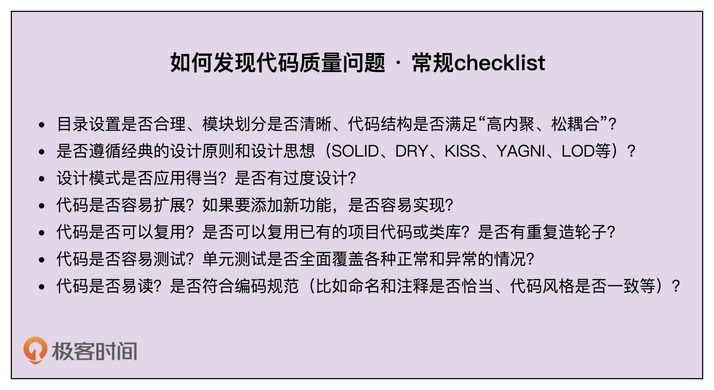

## 如何发现代码质量问题

## 重构代码的步骤
1. 第一轮重构，提高代码的可读性
2. 第二轮重构，提高代码的可测试性
3. 第三轮重构，编写完善的单元测试
4. 第四轮重构，所有重构完成之后添加注释

### 总结
1. 即便是非常简单的需求，不同水平的人写出来的代码，差别可能会很大。花点心思写一段高质量的代码，比写100段凑活能用的代码，对你的代码能力提高更有帮助。
2. 知其然知其所以然，了解优秀代码设计的演变过程，比学习优秀设计本身更有价值。知道为什么这么做，比单纯知道怎么做更重要，这样可以避免你过度使用设计模式、思想和原则。
3. 设计思想、原则、模式本身并没有太多“高大上”的东西，都是一些简单的道理，而且知识点也并不多，关键还是锻炼具体代码具体分析的能力，把知识点恰当地用在项目中。
4. 高手之间的竞争都是在细节。大的架构设计、分层、分模块思路实际上都差不多。没有项目是靠一些不为人知的设计来取胜的，即便有，很快也能被学习过去。所以关键还是看代码细节处理的够不够好。这些细节的差别累积起来，会让代码质量有质的差别。所以，要想提高代码质量，还是要在细节处下功夫。